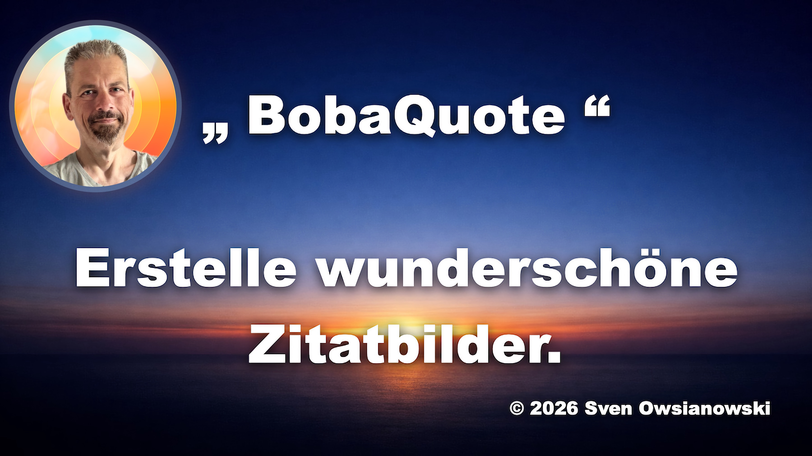

# BobaQuote

   

**BobaQuote** is a graphic quotation generator built as a standalone web application.

The system was originally developed as part of the flat-file CMS and blog system [Bobaro](https://www.bobaro.de) and has been released as an independent web application.

---

## Features

### Text & Quotes

- Quotes are loaded from a `zitate.json` file located in the root directory
- A random quote can be inserted with a single click
- Custom quotes can be written directly in the application
- Text can be freely adjusted: font size, line height, letter spacing, text color, and text shadow

### Background

BobaQuote offers three background modes:

**Gradient**
A selection of preset color gradients is available. Alternatively, two custom colors can be mixed freely. A random color generator creates a new combination with each click. The gradient direction can be selected via a dropdown menu.

**Solid Color**
A single solid background color can be chosen freely.

**Images**
Images are loaded from a server directory and displayed as small thumbnails — regardless of how many images are stored there. Any image can be selected with a single click. Users may also upload their own image at any time.

> **Privacy Notice**
> Uploaded images are never transferred to a server. All processing takes place locally in the browser.

### Text Style

A dedicated style panel allows further customization of the text. An Auto-Fit switch automatically adjusts the font size to fit the canvas.

### Watermark

A text-based watermark with adjustable transparency can be added to the image. It can be placed in any corner or diagonally across the center. Size and opacity are freely configurable.

### Formats

The default canvas size is 1:1 (square). A wide range of common formats is available, including formats for Instagram, Stories, YouTube, Pinterest, LinkedIn, Twitter/X, and more. The canvas adjusts automatically when a format is selected.

### Dark & Light Mode

A toggle in the header switches between dark mode and light mode. The selected preference is saved locally in the browser.

### Help

The help panel provides information about the application, the image gallery, privacy, and the developer.

### Export

Finished images can be exported as **PNG** (lossless) or **JPEG** (smaller file size).

The generated filename follows this pattern:

```
bobaquote-1080x1080-15-06-2026.png
```

It consists of the application name, the canvas dimensions, and the date of generation in German date format.

---

## Privacy & Cookies

BobaQuote does not use any third-party tracking scripts and requires no cookie banner. Only technically necessary resources are loaded, such as Bootstrap via the jsDelivr CDN, which is required to run the application.

localStorage is used solely for saving the selected theme and the gallery consent — no personal data is stored or transmitted.

---

## Developer

Developed by **Sven Owsianowski** · June 2026  
Part of [Bobaro – Bloggen ohne Ballast](https://www.bobaro.de)

---

## License

MIT License · © 2026 Sven Owsianowski

---

## Video

[](https://vimeo.com/1201365780)
