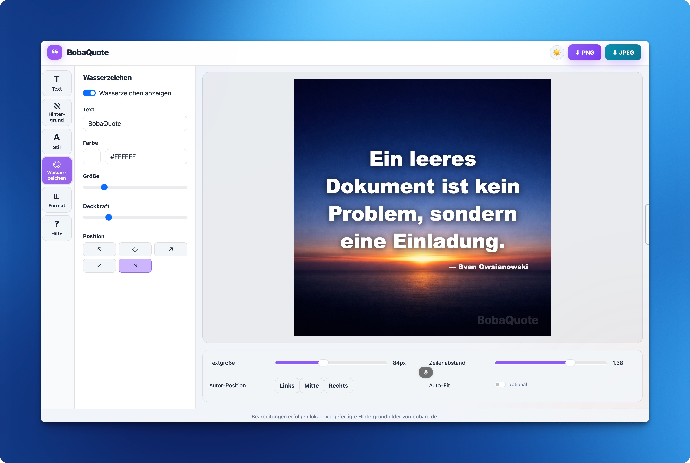

# BobaQuote
   

🇬🇧 **English** | 🇩🇪 [Deutsch](#deutsch)


---

## 🇬🇧 English

**BobaQuote** is a graphic quotation generator built as a standalone web application.

The system was originally developed as part of the flat-file CMS and blog system [Bobaro](https://www.bobaro.de) and has been released as an independent web application.

---

### Features

#### Text & Quotes
- Quotes are loaded from a `zitate.json` file located in the root directory
- A random quote can be inserted with a single click
- Custom quotes can be written directly in the application
- Text can be freely adjusted: font size, line height, letter spacing, text color, and text shadow

#### Background
BobaQuote offers three background modes:

**Gradient**
A selection of preset color gradients is available. Alternatively, two custom colors can be mixed freely. A random color generator creates a new combination with each click. The gradient direction can be selected via a dropdown menu.

**Solid Color**
A single solid background color can be chosen freely.

**Images**
Images are loaded from a server directory and displayed as small thumbnails — regardless of how many images are stored there. Any image can be selected with a single click. Users may also upload their own image at any time.

> **Privacy Notice**
> Uploaded images are never transferred to a server. All processing takes place locally in the browser.

#### Text Style
A dedicated style panel allows further customization of the text. An Auto-Fit switch automatically adjusts the font size to fit the canvas.

#### Watermark
A text-based watermark with adjustable transparency can be added to the image. It can be placed in any corner or diagonally across the center. Size and opacity are freely configurable.

#### Formats
The default canvas size is 1:1 (square). A wide range of common formats is available, including formats for Instagram, Stories, YouTube, Pinterest, LinkedIn, Twitter/X, and more. The canvas adjusts automatically when a format is selected.

#### Dark & Light Mode
A toggle in the header switches between dark mode and light mode. The selected preference is saved locally in the browser.

#### Help
The help panel provides information about the application, the image gallery, privacy, and the developer.

#### Export
Finished images can be exported as **PNG** (lossless) or **JPEG** (smaller file size).

The generated filename follows this pattern:
```
bobaquote-1080x1080-15-06-2026.png
```
It consists of the application name, the canvas dimensions, and the date of generation in German date format.

---

### Privacy & Cookies
BobaQuote does not use any third-party tracking scripts and requires no cookie banner. Only technically necessary resources are loaded, such as Bootstrap via the jsDelivr CDN, which is required to run the application.

localStorage is used solely for saving the selected theme and the gallery consent — no personal data is stored or transmitted.

---

### Developer
Developed by **Sven Owsianowski** · June 2026
Part of [Bobaro – Bloggen ohne Ballast](https://www.bobaro.de)

---

### License
MIT License · © 2026 Sven Owsianowski

---

### Video
[](https://vimeo.com/1201365780)

---
---

## 🇩🇪 Deutsch

**BobaQuote** ist ein Grafik-Zitat-Generator, entwickelt als eigenständige Webanwendung.

Das System wurde ursprünglich als Teil des flatfile-basierten CMS und Blogsystems [Bobaro](https://www.bobaro.de) entwickelt und als unabhängige Webanwendung veröffentlicht.

---

### Funktionen

#### Text & Zitate
- Zitate werden aus einer Datei `zitate.json` im Stammverzeichnis geladen
- Ein Zufallszitat lässt sich mit einem Klick einfügen
- Eigene Zitate können direkt in der Anwendung verfasst werden
- Der Text lässt sich frei anpassen: Schriftgröße, Zeilenhöhe, Buchstabenabstand, Textfarbe und Textschatten

#### Hintergrund
BobaQuote bietet drei Hintergrund-Modi:

**Verlauf**
Eine Auswahl vorgefertigter Farbverläufe steht zur Verfügung. Alternativ können zwei eigene Farben frei gemischt werden. Ein Zufallsgenerator erstellt mit jedem Klick eine neue Kombination. Die Verlaufsrichtung lässt sich über ein Dropdown-Menü auswählen.

**Einfarbig**
Eine einzelne Hintergrundfarbe kann frei gewählt werden.

**Bilder**
Bilder werden aus einem Server-Verzeichnis geladen und als kleine Vorschaubilder angezeigt — unabhängig davon, wie viele Bilder dort gespeichert sind. Jedes Bild kann mit einem Klick ausgewählt werden. Nutzer können außerdem jederzeit ein eigenes Bild hochladen.

> **Datenschutzhinweis**
> Hochgeladene Bilder werden niemals an einen Server übertragen. Die gesamte Verarbeitung erfolgt lokal im Browser.

#### Textstil
Ein eigenes Stil-Panel ermöglicht die weitere Anpassung des Textes. Ein Auto-Fit-Schalter passt die Schriftgröße automatisch an die Leinwand an.

#### Wasserzeichen
Ein textbasiertes Wasserzeichen mit einstellbarer Transparenz kann dem Bild hinzugefügt werden. Es kann in jeder Ecke oder diagonal über die Mitte platziert werden. Größe und Deckkraft sind frei einstellbar.

#### Formate
Die Standard-Leinwandgröße ist 1:1 (quadratisch). Eine breite Auswahl gängiger Formate steht zur Verfügung, darunter Formate für Instagram, Stories, YouTube, Pinterest, LinkedIn, Twitter/X und mehr. Die Leinwand passt sich bei Auswahl eines Formats automatisch an.

#### Dark & Light Mode
Ein Schalter im Header wechselt zwischen Dark Mode und Light Mode. Die gewählte Einstellung wird lokal im Browser gespeichert.

#### Hilfe
Das Hilfe-Panel enthält Informationen zur Anwendung, zur Bildergalerie, zum Datenschutz und zum Entwickler.

#### Export
Fertige Bilder können als **PNG** (verlustfrei) oder **JPEG** (kleinere Dateigröße) exportiert werden.

Der generierte Dateiname folgt diesem Muster:
```
bobaquote-1080x1080-15-06-2026.png
```
Er besteht aus dem Anwendungsnamen, den Leinwand-Maßen und dem Erstellungsdatum im deutschen Datumsformat.

---

### Datenschutz & Cookies
BobaQuote verwendet keine Tracking-Skripte von Drittanbietern und benötigt keinen Cookie-Banner. Es werden nur technisch notwendige Ressourcen geladen, etwa Bootstrap über das jsDelivr-CDN, das für den Betrieb der Anwendung erforderlich ist.

localStorage wird ausschließlich zur Speicherung des gewählten Themes und der Galerie-Zustimmung verwendet — es werden keine personenbezogenen Daten gespeichert oder übertragen.

---

### Entwickler
Entwickelt von **Sven Owsianowski** · Juni 2026
Teil von [Bobaro – Bloggen ohne Ballast](https://www.bobaro.de)

---

### Lizenz
MIT-Lizenz · © 2026 Sven Owsianowski

---

### Video
[](https://vimeo.com/1201365780)``
